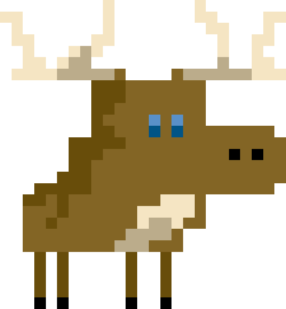
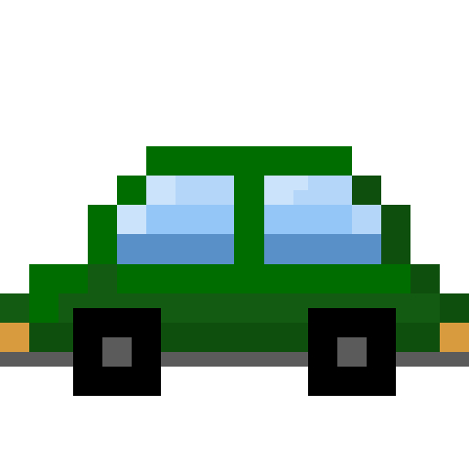

# Harjoitustyön suunnitelma

(Täydennä oman pelisi tiedot tähän tiedostoon muokkaamalla 
tiedostoa tekstieditorissa. Käytä [Markdown-syntaksia](https://about.gitlab.com/handbook/markdown-guide/).
Poista sitten *kaikki* suluilla merkityt kohdat.)

## Tietoja 

Tekijä: Joonas Tolvanen

Työ git-varaston osoite: <https://gitlab.jyu.fi/anlakane/ohj1ht> (*Korvaa* tämä osoite oman git-varastosi osoitteella)

Pelin nimi: MooseVsCars

Pelialusta: Windows

Pelaajien lukumäärä: 1

## Pelin tarina

Pelin tarina kertoo hirvestä jonka ainut elämäntehtävä on koittaa tuhota mahdollisimman monta autoa. 

## Pelin idea ja tavoitteet

Pelin ideana on koittaa tuhota autoja hyppimällä niiden päälle. Autoja on erilaisia, pienistä autoista 
(riisikippo) saat pisteitä ja isoista autoista (Katumaasturit ja rekat) menetät elämiä.

## Hahmotelma pelistä

(Kun olet lisännyt suunnitelmakuvan tähän hakemistoon, linkitä se tähän alle. Alla on esimerkkikuvan linkitys.)

## Toteutuksen suunnitelma

Helmikuu

- Hahmojen luominen
- Pelin koodaamisen aloitus
- Hahmojen animointi
- Kentän luominen

Maaliskuu

- Hahmojen lisääminen peliin
- Pistemittarin luominen
- Elämämittarin luominen

Jos aikaa jää

- Kenttien viimeistely
- Useampi kenttä
- Pistelista
